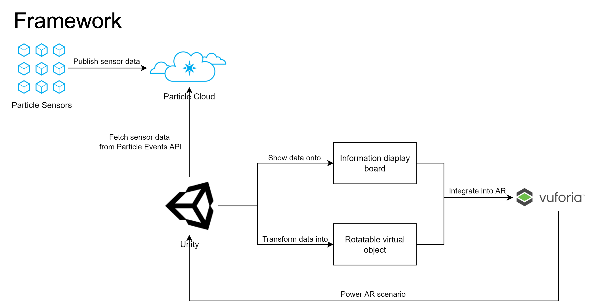
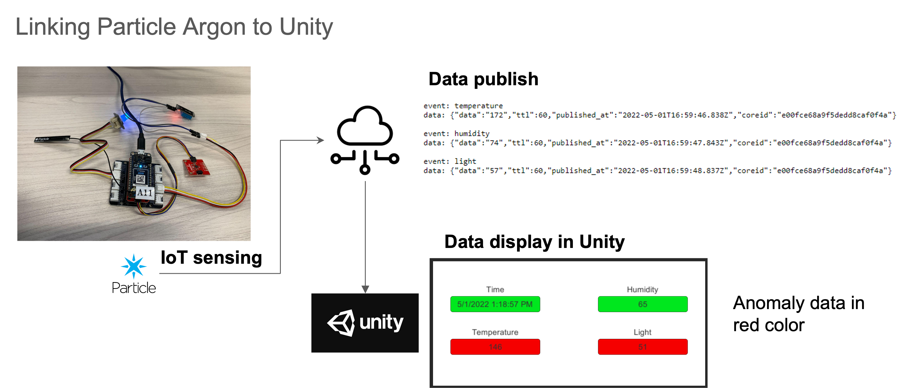
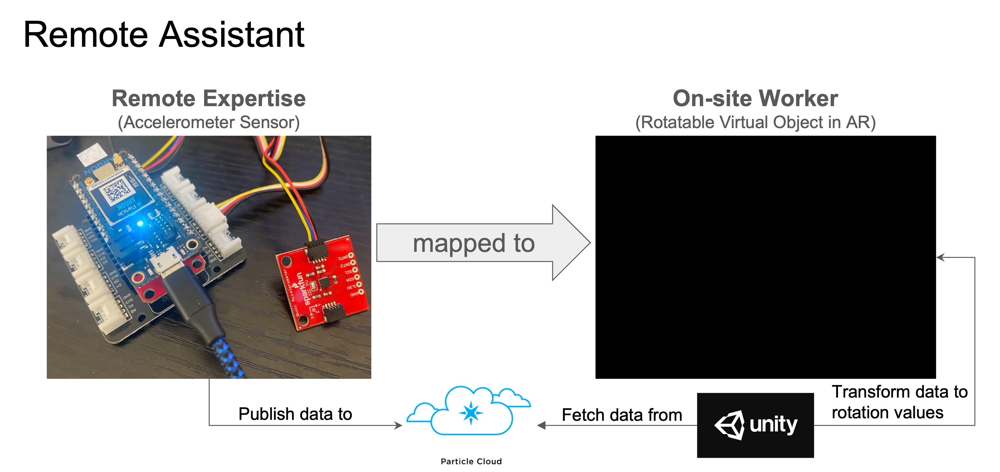

# Context-aware IoT-AR Assistance for Civil Infrastructure Inspection

This project aims to provide context-aware information displays for building inspection: indoor localization and Augmented Reality (AR) based context-aware information display. Workers perform building inspection tasks following predefined procedures to ensure building operation efficiency.

- Jinding Xing, Department of Civil and Environmental Engineering
- Ruoxin Xiong, Department of Civil and Environmental Engineering
- Tingxuan Gu, Information Networking Institute

## Framework

## Unity Package Download

